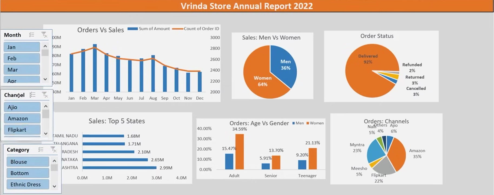

# 📈 Retail Sales Analysis – Excel Dashboard

An **interactive Sales Analytics Dashboard** built using **Microsoft Excel**, designed to analyze **Vrinda Store sales performance** across various dimensions like month, gender, order status, states, and channels.

---

## 📊 Dashboard Overview
  
*Replace `vrinda_sales_dashboard.png` with the exact filename and path if you put it in a folder (e.g., `assets/vrinda_sales_dashboard.png`).*

This dashboard provides **actionable insights** into sales patterns and customer buying trends.

| Metric               | Value      |
|:---------------------|:-----------|
| 🛒 Total Orders      | **[Your Total Orders]** |
| 💸 Total Sales       | **₹[Your Total Sales]** |
| 🧑‍🤝‍🧑 Male Customers  | **[Your Male Customer %]** |
| 👩 Female Customers | **[Your Female Customer %]** |
| ✅ Delivered Orders  | **[Your Delivered Orders %]** |
| 🔄 Refunded Orders   | **[Your Refunded Orders %]** |
| ❌ Cancelled Orders  | **[Your Cancelled Orders %]** |

---

## 🔍 Key Visualizations

- 📈 **Orders Vs Sales by Month** → Reveals monthly sales trends.
- 🚻 **Sales: Men Vs Women** → Highlights gender-based purchasing power.
- 📦 **Order Status** → Shows the distribution of delivered, refunded, returned, and cancelled orders.
- 🗺️ **Sales: Top 5 States** → Identifies key geographical markets.
- 🎂 **Orders: Age Vs Gender** → Analyzes purchasing behavior across different age groups and genders.
- 🛒 **Orders: Channels** → Breaks down sales by e-commerce platforms (Amazon, Flipkart, Myntra, etc.).
- 🧭 **Interactive Filters:** Month, Channel, Category (e.g., Blouse, Bottom, Ethnic Dress).

---

## 💡 Business Insights

The dashboard reveals that:
- **[Insert an insight from your chart, e.g., "Sales peak during [Month] and decline towards the end of the year." or "Women account for a significant portion of sales, indicating a strong female customer base."].**
- **[Insert another insight, e.g., "A high percentage of orders are delivered, but there's a small percentage of refunds and cancellations that could be investigated."].**
- **[Insert another insight, e.g., "The majority of sales come from specific states, suggesting targeted marketing could be beneficial."].**
- **[Insert another insight, e.g., "Specific age groups or product categories show higher sales, which can inform inventory and marketing strategies."].**

These insights can help the Vrinda Store team **optimize inventory, marketing campaigns, customer targeting, and operational efficiency.**

---

## 🛠️ Tools & Technologies

- **Microsoft Excel** – Data cleaning, analysis & dashboard design
- **CSV/Excel Dataset** – Raw sales data source

---

## 📁 Project Files

| File                       | Description                        |
|----------------------------|------------------------------------|
| `Vrinda Store Data Analysis.xlsx` | The main Excel dashboard file      |
| `vrinda_sales_dashboard.png` | Dashboard preview image            |
| `retail_sales_analysis.csv` | Cleaned dataset used for analysis (if applicable) |

---

## 🚀 How to Use

1.  **Download** the `Vrinda Store Data Analysis.xlsx` file from this repository.
2.  **Open** it in **Microsoft Excel**.
3.  **Use filters & slicers** to explore sales patterns and trends.

---

## 👩‍💻 Author
[Your Name/GitHub Handle]
